# BeeHive

##  General Assembly: Software Engineering Immersive - Project 3

[Click here to open the application on Heroku](https://beehive-network.herokuapp.com/)

## Overview

This was a full-stack web application designed to help creatives from different specialties connect and collaborate on projects created by its members. I worked in a team of four for a week to create this application. We all contributed to the initial idea and design of the website, creating wireframes and taking inspiration from a website called ‘The Dots’. We built the front end using React and the backend with MongoDB, Express, and Node.js. I was involved in all parts of the website but took ownership of much of the back end and the messaging system. We used Agile methodology to distribute work, holding ‘scrums’ regularly and tracking our project on Trello. Our team worked very well together, coordinating to avoid merge conflicts on GitHub and finishing all MVPs well ahead of time. This left us with enough time to implement some additional features and polish the visuals to produce an application that looks extremely professional, with a high degree of quality throughout.  

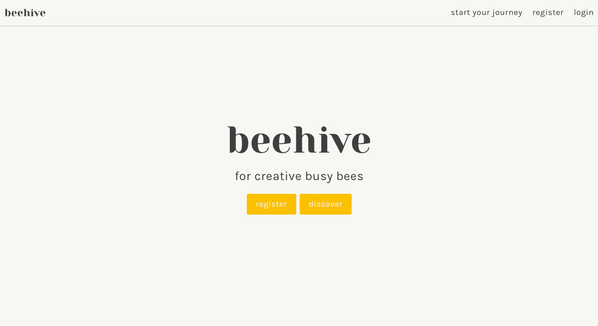

## Goal
To create a full-stack MERN application that uses React in the frontend and MongoDB, Express, and Node.js in the backend. 

### Timeframe
1 week

### Teammates
- [Jos Bogan](https://github.com/JosBogan)
- [Abigail Foreman](https://github.com/abigailforeman1)
- [John Magnus Robertson](https://github.com/jaymagrob)

### Technologies used
JavaScript, React, MongoDB, Express, Node.js, Axios, Sass, Bulma, Google Fonts, Mocha, Chai, Git, Yarn, GitHub, Cloudinary, Insomnia.

## Instructions

1. To get the most out of this application, you will need to make an account. This will allow you to use all the features of this Restful application such as creating and editing your user profile and projects. To do this, navigate to the Register page and add your details. You will then be prompted to log in.

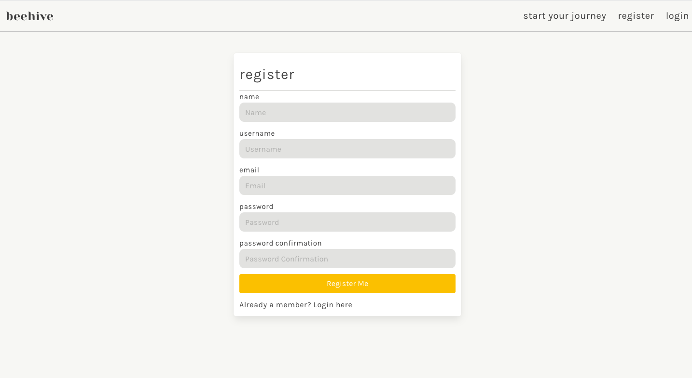

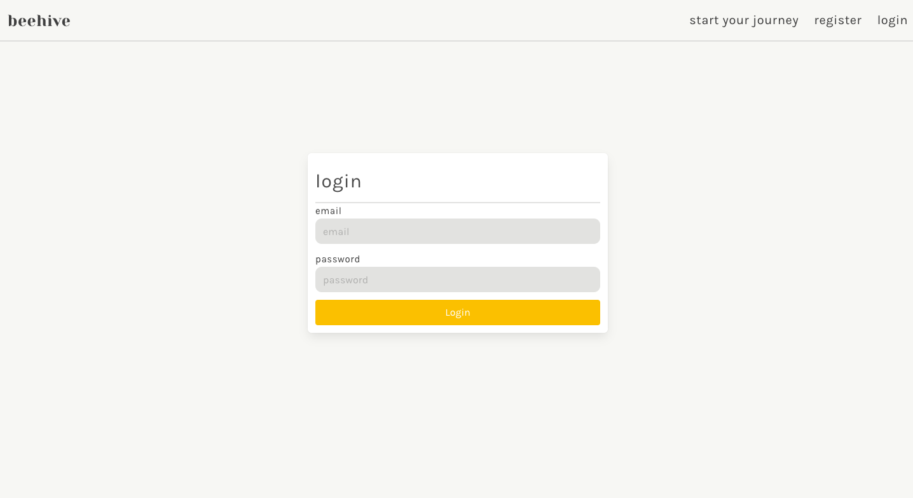

2. The first time you log in you will be presented with some suggestions to help you make the most of the site.

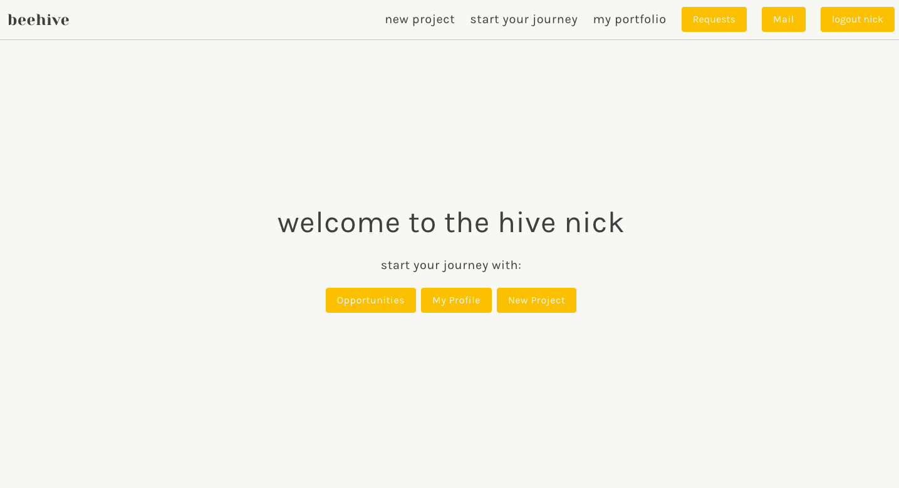

3. Complete your profile.

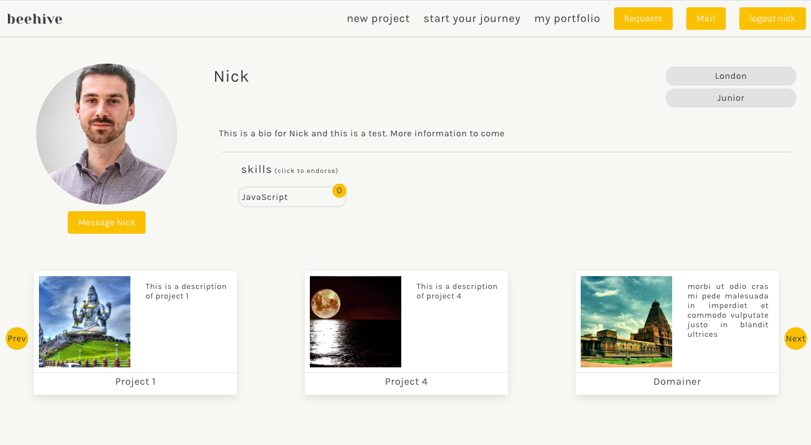

4. Add a project.

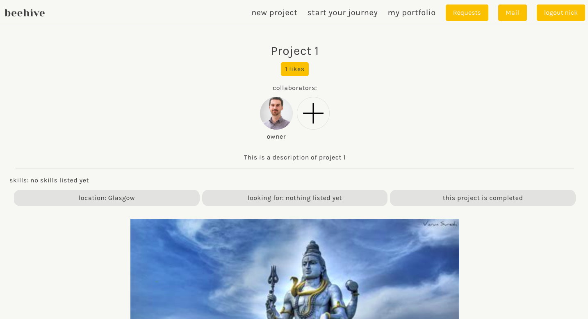

5. Explore the site.

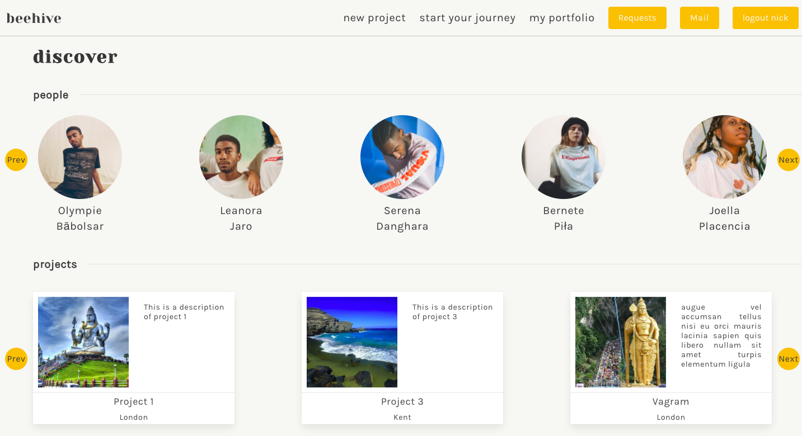

6. Search for projects and creatives.

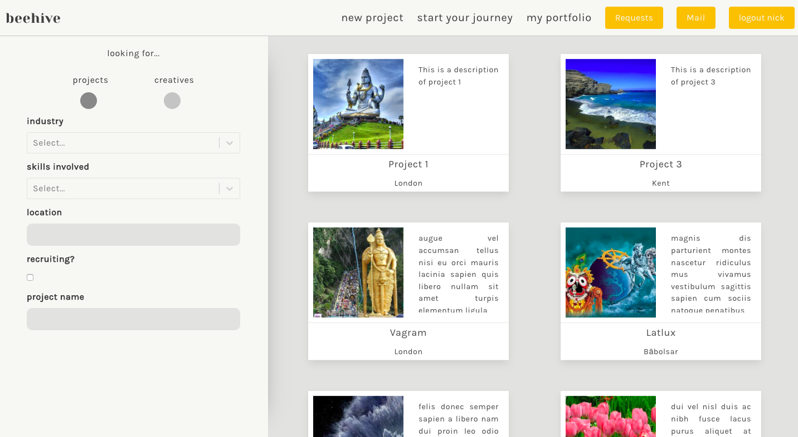

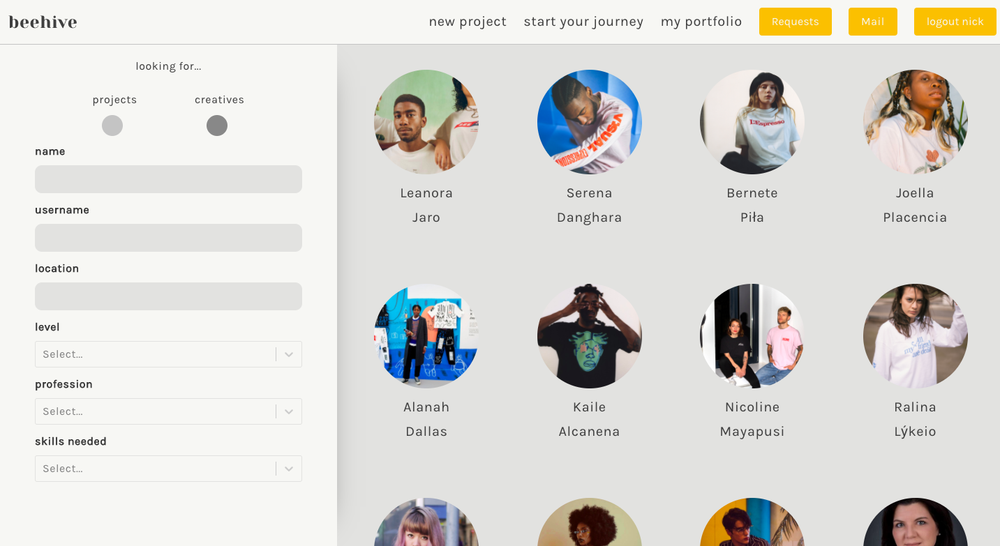

7. Message someone.

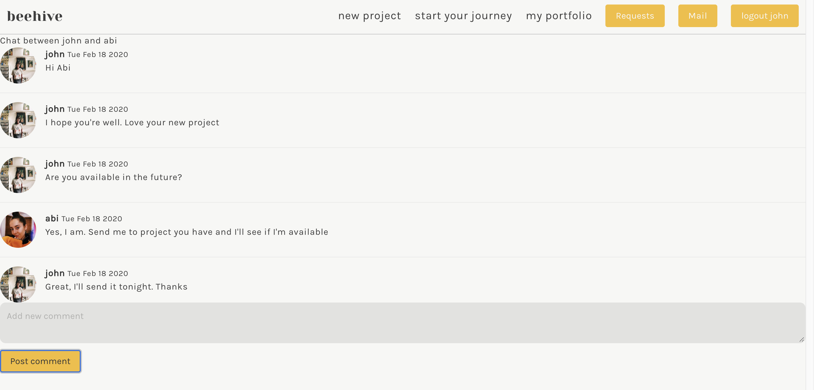

8. Request to be part of a project.

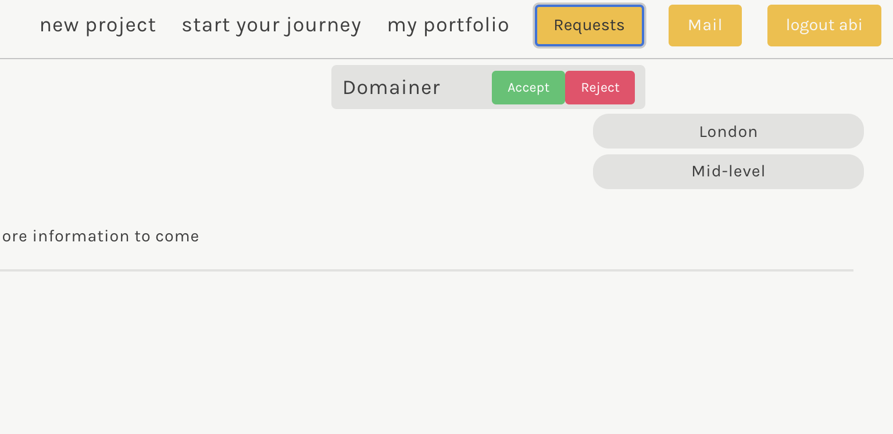

## Development

I worked in a team of four for a week to create this application. We all contributed to the initial idea and design of the website, creating wireframes and taking inspiration from a website called ‘The Dots’. 

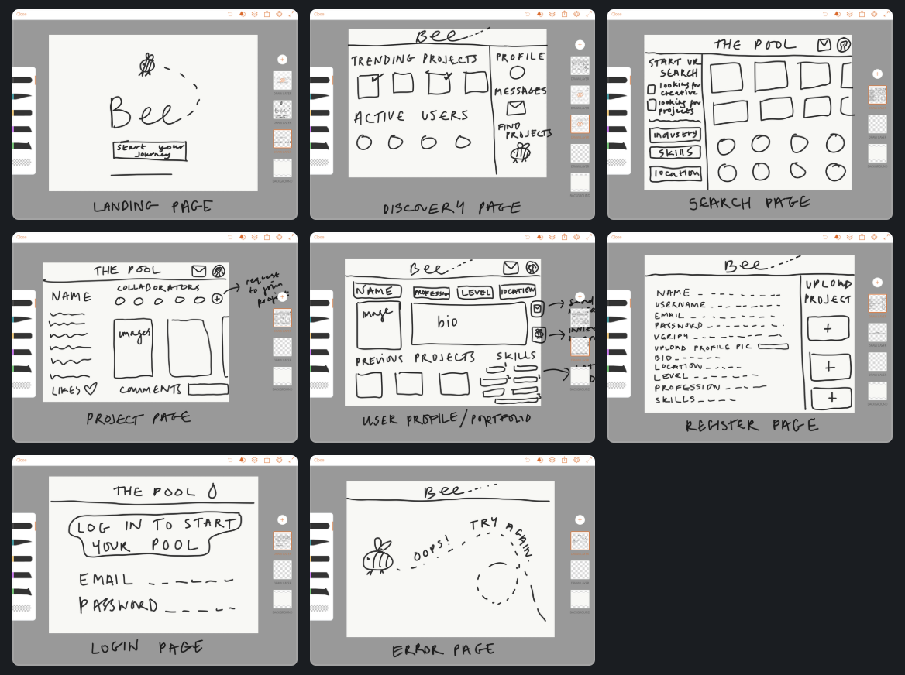

We built the frontend using React and the backend with MongoDB, Express, and Node.js. We used Chai and Mocha to test the backend. I was involved in all parts of the website but took ownership of much of the backend, built the skeleton of a lot of the frontend, and created the messaging system.

ChatBox backend model:

```javascript
const mongoose = require('mongoose')


//! creating private collab messages schema
const messageSchema = new mongoose.Schema({
  text: { type: String, required: true, maxlength: 150 },
  user: { type: mongoose.Schema.ObjectId, ref: 'User', required: true }
}, {
  timestamps: true
})

//! creating chatbox schema
const chatBoxSchema = new mongoose.Schema({
  members: [{ type: mongoose.Schema.ObjectId, ref: 'User' }],
  owner: { type: mongoose.Schema.ObjectId, ref: 'User' },
  messages: [ messageSchema ]
}, {
  timestamps: true
})

chatBoxSchema.plugin(require('mongoose-unique-validator'))

module.exports = mongoose.model('ChatBox', chatBoxSchema)
```

ChatBox backend controller
```javascript
const ChatBox = require('../models/chatBox')

function index(req, res) {
  ChatBox
    .find()
    .populate('members')
    .then(foundChatBoxes => res.status(200).json(foundChatBoxes))
    .catch(err => res.status(400).json(err))
}

function create(req, res) {
  req.body.owner = req.currentUser
  req.body.members = [req.currentUser, req.params.userId]
  ChatBox
    .create(req.body)
    .then(createdChatBox => {
      console.log(req.body)
      return res.status(202).json(createdChatBox)
    })
    .catch(err => res.status(400).json(err))
}

function show(req, res) {
  ChatBox
    .findById(req.params.id)
    .populate('members')
    .populate('messages.user')
    .then(chatBox => {
      return res.status(202).json(chatBox)
    })
    .catch(err => res.status(400).json(err))
}


function messageCreate(req, res, next) {
  req.body.user = req.currentUser
  ChatBox
    .findById(req.params.id)
    .populate('members')
    .populate('messages.user')
    .then(chatBox => {
      if (!chatBox) return res.status(404).json({ message: 'Not Found' })
      chatBox.messages.push(req.body)
      return chatBox.save()
    })
    .then(chatBox => res.status(201).json(chatBox))
    .catch(next)
}

function messageDelete(req, res) {
  ChatBox
    .findById(req.params.id)
    .then(chatBox => {
      if (!chatBox) return res.status(404).json({ message: 'Not Found' })
      const message = chatBox.messages.id(req.params.messageId)
      if (!message.user.equals(req.currentUser._id)) return res.status(401).json({ message: 'Unauthorized' })
      message.remove()
      return chatBox.save()
    })
    .then(chatBox => res.status(204).json(chatBox))
    .catch(err => res.json(err))
}


module.exports = { index, create, show, messageCreate, messageDelete }

```

We used Agile methodology to distribute work, holding ‘scrums’ regularly and tracking our project on Trello.

## Challenges

The main challenge of this project was the enormous scope that we had set ourselves. We figured four people could do a lot in 1 week but in order to be successful we needed to coordinate our efforts. We managed the project using Trello, avoiding working on the same components where possible in order to avoid merge conflicts when we pushed the code to GitHub.

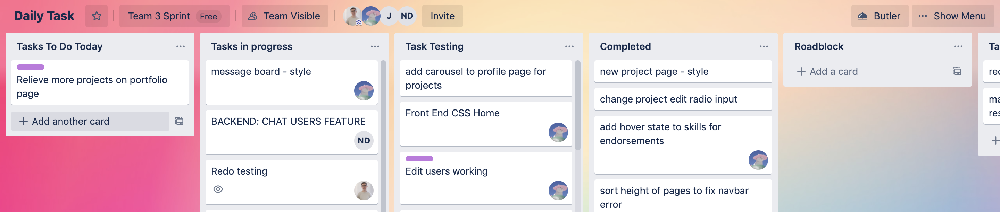

## Wins

This was a lot of work but we got there and it went pretty smoothly throughout. We managed to avoid major merge conflicts and worked very harmoniously together. We really built a lot in our week's timeframe and I believe that this application could be a viable product.

## Future features

We actually got most of the ideas we proposed implemented within the timeframe. The messaging system could be improved by installing WebSocket, which would allow instant messaging. Currently the messaging system relies on the Restful API, which requires that the user make requests to see new messages.

## Key learnings

My main learnings from this project were the advantages and limitations of working in a somewhat large team. Everything needed to be coordinated and communicated before proceeding which could slow things down but when done properly it means the team can produce a lot more than an individual could in the long run.